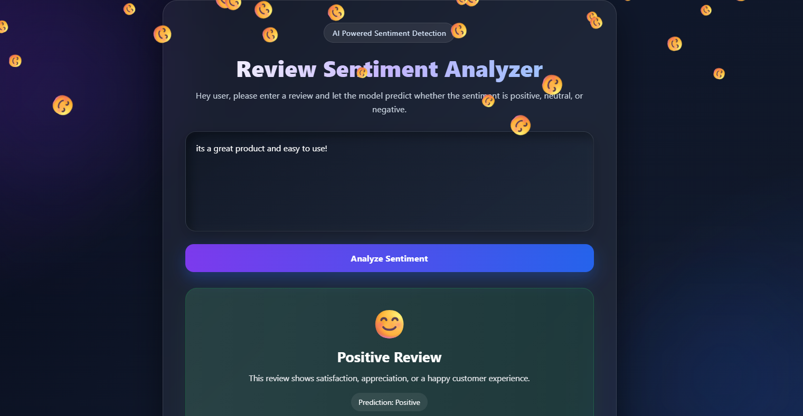

# 💬 Sentiment Analysis Web App

A machine learning web application that classifies user reviews as Positive 😊, Neutral 😐, or Negative 😞 in real time.

---

## 🚀 Overview

This project combines Machine Learning, NLP, and Flask to build a web app where users can enter a review and instantly get sentiment prediction.

---

## 🤖 Machine Learning

- Text preprocessing using NLTK  
- TF-IDF Vectorization  
- Logistic Regression model  
- Model saved and reused for prediction  

---

## 🎨 UI

- Clean dark themed interface  
- Input box for review  
- Result display with emoji 😊 😐 😞  
- Animated falling emoji effect  

---

## 🛠 Tech Stack

Python, Flask, Scikit-learn, NLTK, Pandas, HTML, CSS, JavaScript  

---

## ▶️ Run

pip install flask nltk scikit-learn pandas  
python app.py  

Open: http://127.0.0.1:5000/

---

## 📸 Preview

---

## 👨‍💻 Author

Kashish Sharma